# PolyKybd Split72

Official hardware repository of the PolyKybd Split72 keyboard. The instructions here are still in a very early stage. There is also a build video available: https://www.youtube.com/watch?v=K5RpbYzx7gw

You can find the matching QMK firmware here: [https://github.com/thpoll83/qmk_firmware/tree/PolyKeyboard](https://github.com/thpoll83/qmk_firmware/tree/PolyKeyboard)

The Kicad7 projects for the PCB are the following:

[poly_kybd/poly_kb_wave_right2.kicad_pro](poly_kybd/poly_kb_wave_right2.kicad_pro)
[poly_kybd/poly_kb_wave_left2.kicad_pro](poly_kybd/poly_kb_wave_left2.kicad_pro)

(`wave` was the the prototype name, please just ignore the other projects)

The keyboard plates are also Kicad7 projects (I used 1.2mm aluminium PCBs):

[poly_kybd/poly_kb_wave_right2_plate.kicad_pro](poly_kybd/poly_kb_wave_right2_plate.kicad_pro)
[poly_kybd/poly_kb_wave_left2_plate.kicad_pro](poly_kybd/poly_kb_wave_left2_plate.kicad_pro)

## How to Build

I recommend waiting for the kit that contains all parts and the assembled PCBs. Here a little preview, how that looks like:
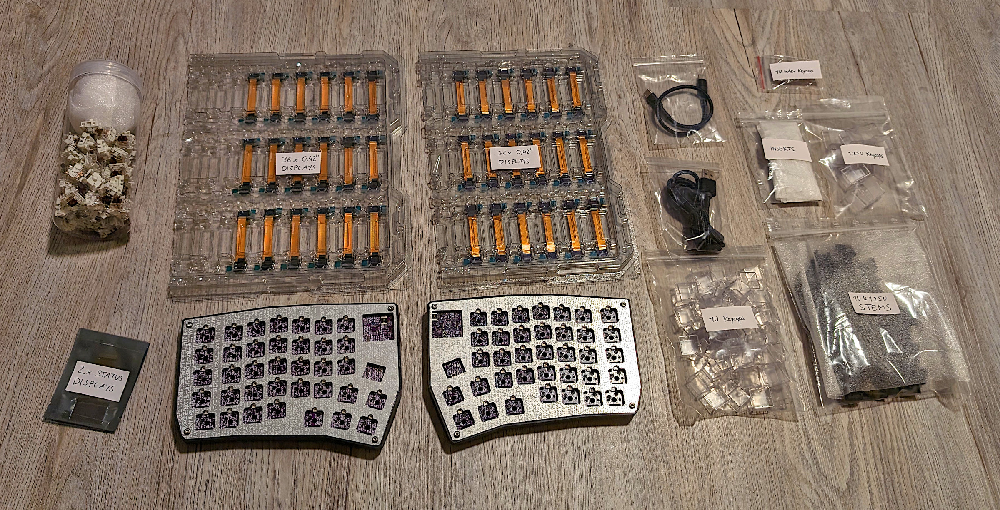
The kits are not yet ready, but you can sign up here and get notfified as soon as these are available: [https://www.crowdsupply.com/polykybd/polykybd](https://www.crowdsupply.com/polykybd/polykybd)

At the moment, please consider these instructions as experimental. If you want to go ahead with the full experience and build everything from scratch right now: Give it a try and let me know how it worked out!

Independent of your choice, here are the parts you need before putting everything together:

### Prepare Required Parts

* Case (left/right) - You can either 3D print or get them CNCed (but then you should add some threads to the screw holes):
  [case/case_polysplit72_left2_r4.stl](case/case_polysplit72_left2_r4.stl)
  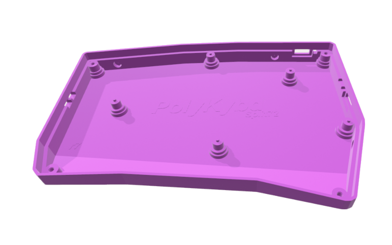
  [case/case_polysplit72_right2_r4.stl](case/case_polysplit72_right2_r4.stl)
  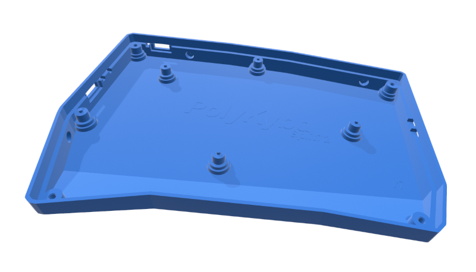
  In case the resin print has some deformations, it is best to use the a hairdryer to slightly heat the case up and then put something heavy on the bottom to make it flat - it really works.
* Spacer to keep the right distance between plate and PCB (again, can be 3D printed):
  [case/spacer.stl
  
  ](case/spacer.stl)
* Assembled 4 layers PCB 1.6mm (left/right)
  The latest gerber files with BOM and pick/place file can be found in [poly_kybd/Gerber](poly_kybd/Gerber) I made some final adjusts on the latest version, which I did not yet order (I will let you know as soon as I did).
  [poly_kybd/Gerber/PCB/left-side-v3.1/gerber-left-side-v3.1-08.01.2024.zip](poly_kybd/Gerber/PCB/left-side-v3.1/gerber-left-side-v3.1-08.01.2024.zip)
  [poly_kybd/Gerber/PCB/right-side-v3.1/gerber-right-side-v3.1-08.01.2024.zip](poly_kybd/Gerber/PCB/right-side-v3.1/gerber-right-side-v3.1-08.01.2024.zip)

  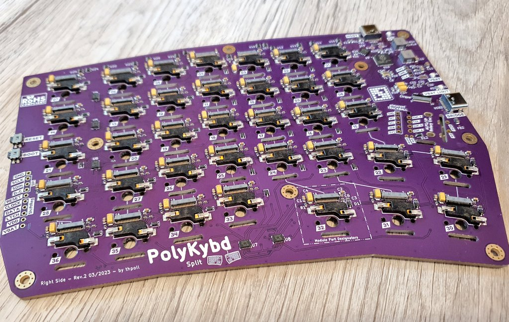

  My recommendation is to let assemble the PCBs as there are a lot of parts with tiny footprints like the RP2040, the 72 FPC sockets and some more...
  If your PCB fab has an option to verify the parts orientation, please make use of it. I did that as well and never bothered correcting them (since the 'upright' orientation of the part from Kicad and your PCB fab might differ).

  ###### Note:

  In case you make modifications to the PCB in Kicad and export everything you might need to change the hot swap sockets side to the back. The hot swap socket in Kicad is part of the key switch and for some reason I couldn't yet convince Kicad that the manufacturing side is the back...
* Aluminum plates (left/right =) - Can be ordered from PCB manufactures as a 1.2mm aluminum PCB
  [poly_kybd/Gerber/Plate/gerber-left-side-v3-17.11.2023.zip](poly_kybd/Gerber/Plate/gerber-left-side-v3-17.11.2023.zip)
  [poly_kybd/Gerber/Plate/gerber-right-side-v3-17.11.2023.zip](poly_kybd/Gerber/Plate/gerber-right-side-v3-17.11.2023.zip)
* Displays
  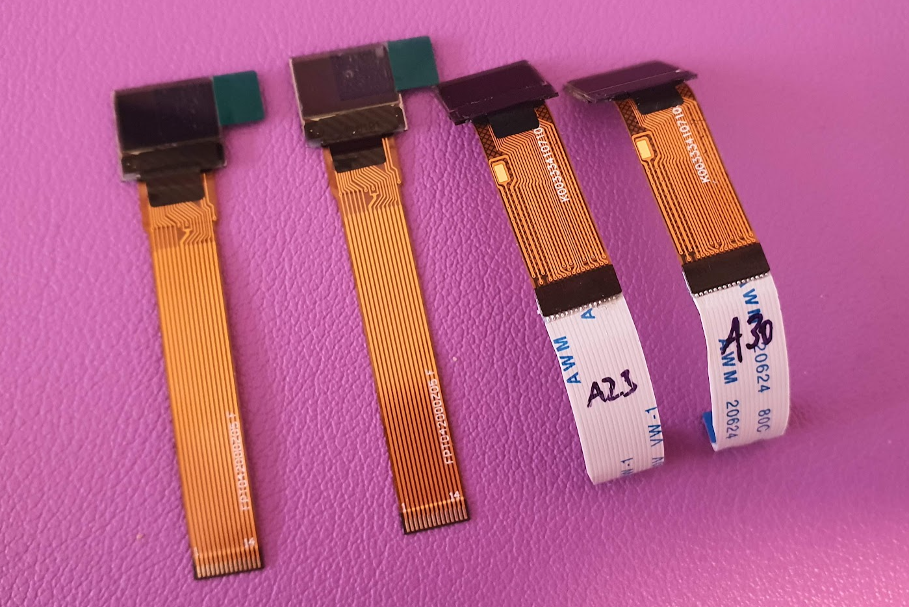

  - 72 pieces 0.42 inch displays

    - Either you take the 0.42 inch displays from the kit which has the matching length and pin number (maybe I can make them available as single parts as well - see picture above, on the left).
    - Or you extend *[FPT042W000Z01](https://www.alibaba.com/product-detail/OLED-Display-0-42-Inch-Small_1600693977243.html) or *[P34107](https://www.alibaba.com/product-detail/OLED-display-OLED-0-42-Inch_1600104997388.html) with a [30mm FPC cable](https://de.aliexpress.com/item/1005001935872949.html) ( * I got contacted that these Alibaba links are stale and it turned out, that the moment, these do not work as the displays got removed. Let me keep them in case they come back online. Maybe you can use these as alternative, the pins are compatible: [ZJY042-7240TSWPG10](https://www.alibaba.com/product-detail/0-42-inch-72x40-OLED-display_1600820452544.html?spm=a2700.details.0.0.11f34384WPrOet) The flex cable is about 1cm shorter, so your extension needs to be 40mm instead of 30mm. I have not tried these, so you might wanna do a test first!). The FPC extension should be 14 or 16 pins - blank contacts on the same side, like the two right side displays on the picture above. Only 14 pins are needed, however, you might want to get a 16 pin FPC and cut away 2 pins to fit the FPC into the 14 pin socket. It is easier to solder 16 pins of the display together with the 16 pins of the FPC (so the cable aligns), see here:
      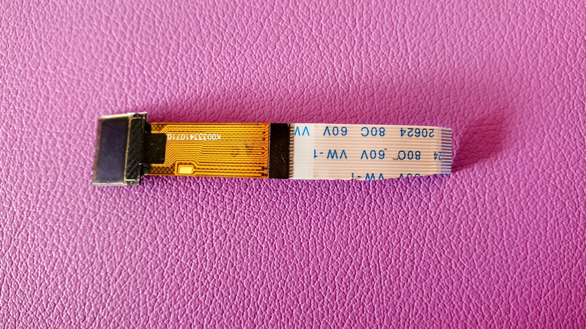
      To achieve this, I applied low temperature solder (138 degree C) on both, the display FPC pins and the extension FPC pins with the solder iron:
      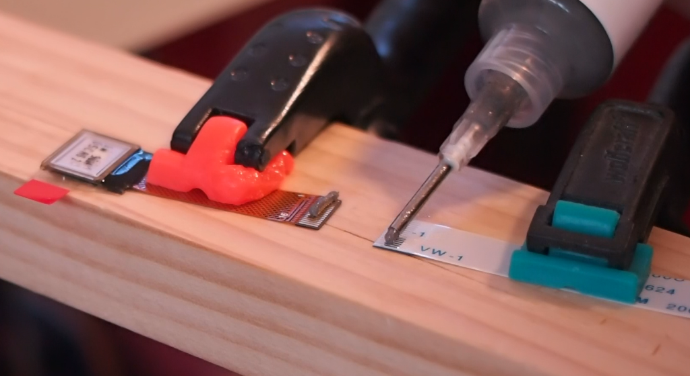
      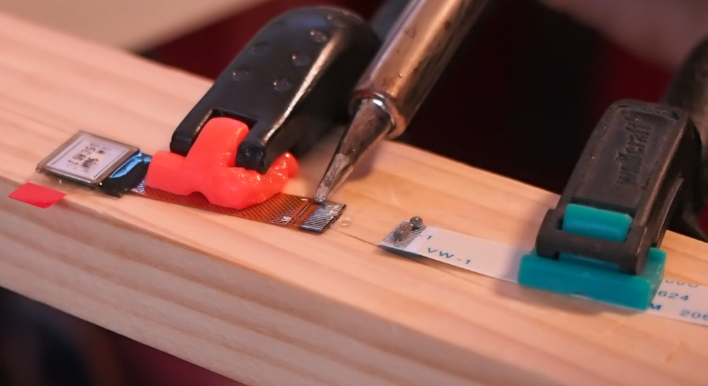
      Then applied some flux on just one side and orientated them straight - don't overlap the pins 100%, leave some space at the end so that excess solder can have some space to escape:
      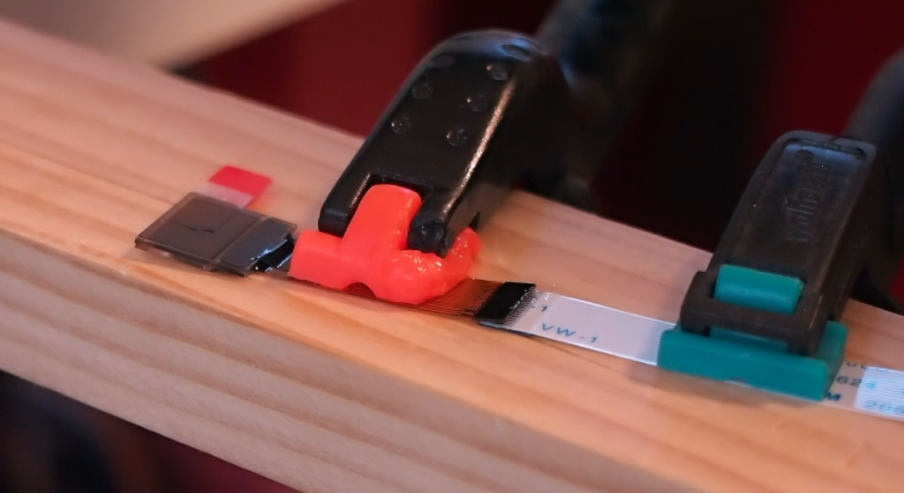
      Next, I used the heat gun with maybe 160 C and heated both sides for a few seconds (you can see the solder becoming liquid again):
      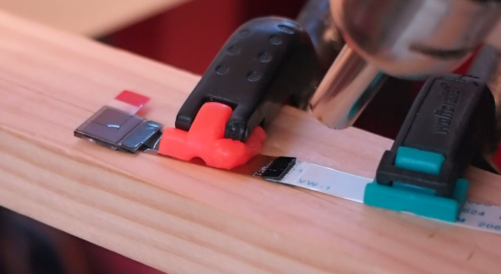
      Finally use some tweezers to push the pins together. You will see some solder coming out at the non-overlapping part of the pins I mentioned to leave out. This is also a good way to see that all pins have sufficient solder and will connect properly:
      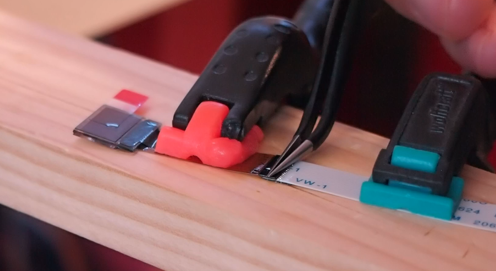
      Not every display survived this surgery, so better get more from the beginning.
  - (Optional) 2 pieces 0.96 inch status displays (FPW096W001Z0) or pin compatible (see below), the flex cable length should be about 40mm or you extend it on your own. You can contact this supplier: [FET](https://fetoled.en.alibaba.com/search/product), they have these displays even they are not listed in their online catalogue.

    | PIN   | SIGNAL    | PIN   | SIGNAL |
    | ----- | --------- | ----- | ------ |
    | 1,30  | N/C (GND) | 14    | RES#   |
    | 2,3   | C2P,C2N   | 15    | D/C#   |
    | 4,5   | C1P,C1N   | 16    | R/W#   |
    | 6     | VDDB/VBAT | 17    | E/RD#  |
    | 7     | N/C       | 18~25 | D0~D7  |
    | 8     | VSS       | 26    | IREF   |
    | 9     | VDD       | 27    | VCOMH  |
    | 10~12 | BS0~BS2   | 28    | VCC    |
    | 13    | CS#       | 29    | VLSS   |
    
    If you don't need the status displays, you can close the display cut-out with the dummy holder: [Dummy Display Holder](parts/display_holder_dummy_r1.stl)

* MX Compatible key switches (3 or 5 pins) - 72 pieces. From my blog post ( [https://ko-fi.com/post/More-Key-Switch-Testing-While-Waiting-For-The-Asse-B0B8HX1HW](https://ko-fi.com/post/More-Key-Switch-Testing-While-Waiting-For-The-Asse-B0B8HX1HW) ), you can find out, that there are 2 categories of compatible key switches. The ones that work out of the box and the ones that need a little modification. Basically all switches that have an LED slit that is at least 7.5mm wide work. I tested quite some switches and here is the list of tested switches that will work for sure without modification:

  | SWITCH                            | TYPE    | MISC  |
  | --------------------------------- | ------- | ----- |
  | Aflion Tropical Waters            | Linear  | 68g   |
  | Ashkeebs Alexandrite              | Linear  | 58g   |
  | Blue Dusk Panda                   | Linear  | 62g   |
  | Gateron KS-9 (Pro) Blue           | Clicky  | 60g   |
  | Gateron KS-9 (Pro) Brown          | Tactile | 55g   |
  | Gateron KS-9 (Pro) Green          | Clicky  | 80g   |
  | Gateron KS-9 (Pro) Red            | Linear  | 45g   |
  | Gateron KS-9 (Pro) Yellow         | Linear  | 50g   |
  | Geon Black                        | Tactile | 60g   |
  | Geon Clear                        | Linear  | 60g   |
  | Geon Yellow                       | Linear  | 63.5g |
  | Glorious Panda                    | Tactile | 67g   |
  | GOJU Works x Tecsee Safety Switch | Linear  | 65g   |
  | Kailh Novel Keys Cream Switch     | Linear  | 55g   |
  | Kailh Purple Potato               | Tactile | 63.5g |
  | Kailh x Domikey Knight Saber      | Tactile | 42g   |
  | LCET Grace                        | Linear  | 50g   |
  | LCET Joker                        | Tactile | 58g   |
  | LCET Pink Queen                   | Tactile | 58g   |
  | LCET Sprout                       | Linear  | 50g   |
  | Outemu (Dustproof) Black          | Linear  | 65g   |
  | Outemu (Dustproof) Blue           | Clicky  | 65g   |
  | Outemu (Dustproof) Brown          | Tactile | 50g   |
  | Outemu (Dustproof) Red            | Linear  | 46g   |
  | Outemu Purple                     | Tactile | 45g   |
  | Outemu Teal                       | Clicky  | 70g   |
  | Owlab Neon                        | Linear  | 62g   |

  Be aware that there are different batches of Gateron KS-9 (with and without 'Pro') switches. Despite the exact same name, they might need the following surgery (better ask before buy).
  So, some switches have an LED slit, but with a little plastic bar in the middle:

  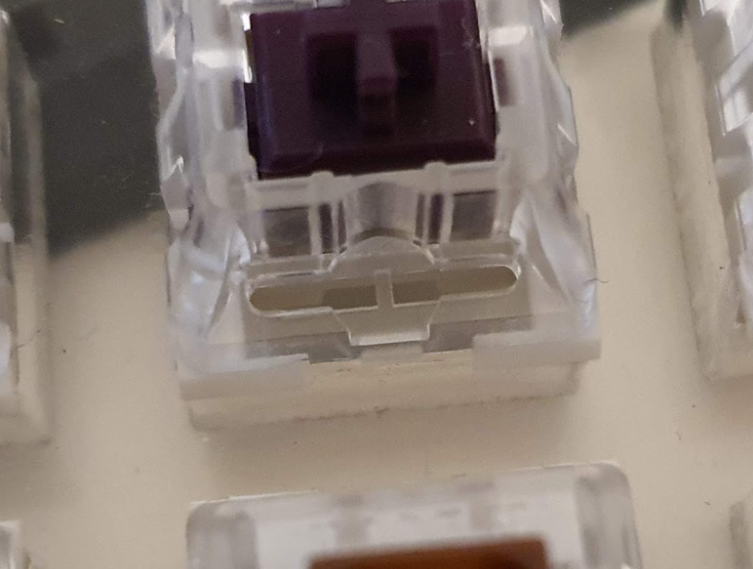

  You can simply cut it away with a knife:

  

  It is not a big deal, just consider it. Here is a list of switches that I successfully tested after this little modification:

  | SWITCH                           | TYPE           | MISC |
  | -------------------------------- | -------------- | ---- |
  | Gateron KS-9 (Pro 2.0) Red       | Linear         | 45g  |
  | Gateron KS-9 (Pro 2.0) White     | Linear         | 35g  |
  | Geon HG [Haimu x Geon] Black     | Linear         | 65g  |
  | Geon HG [Haimu x Geon] White     | Tactile        | 65g  |
  | Geon HG [Haimu x Geon] Red       | Silent Linear  | 65g  |
  | Geon HG [Haimu x Geon] Yellow    | Silent Tactile | 65g  |
  | Kailh BOX V2 Red Switch          | Linear         | 40g  |
  | Kailh Box Cream                  | Linear         | 45g  |
  | Kailh Pro Purple                 | Tactile        | 50g  |
  | Kailh Pro Burgundy               | Linear         | 50g  |
  | Kailh Pro Light Green            | Clicky         | 50g  |
  | Kailh Pro Plum                   | Tactile        | 70g  |
  | Kailh Speed Gold                 | Clicky         | 50g  |
  | Kailh Speed Silver               | Linear         | 50g  |
  | Kailh Speed Bronze               | Clicky         | 50g  |
  | Kailh Speed Copper               | actile         | 40g  |
  | Kailh Speed Burnt Orange         | Linear/Tactile | 70g  |
  | Kailh Speed Pro Heavy Army Green | Clicky         | 70g  |
  | Kailh Speed Pro Heavy Yellow     | Linear         | 70g  |
  | Kailh Black                      | Linear         | 60g  |
  | Kailh RGB Red                    | Linear         | 45g  |
  | Kailh RGB Black                  | Linear         | 60g  |
  |  Kailh RGB Blue                   | Clicky         | 50g  |
  | Kailh RGB Brown                  | Tactile        | 50g  |

  There are many more switches that will work as long as they have a 7.5mm wide LED slit. Let me know in case you successfully tried another switch, then I can update the list.
  
* Key Stems - 72 pieces, can be 3D printed (I highly recommend using an SLA printer). There are 3 different profiles available here. You can also modify the source file an make your own profile. If you take the STLs, make sure to always grab the latest version.

  - Flat 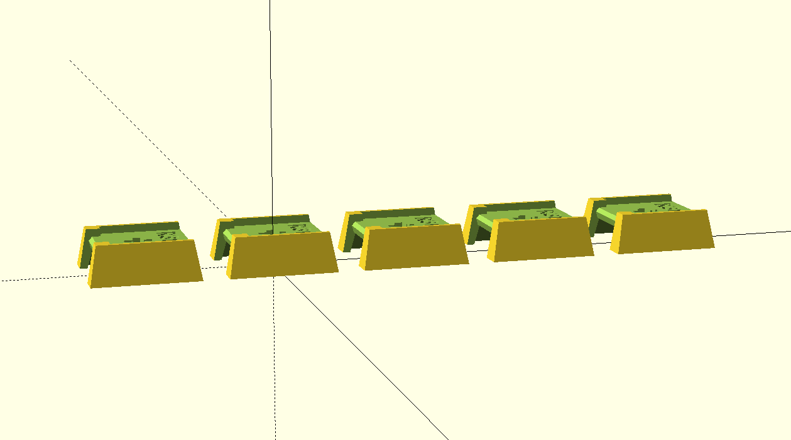
    For that simply use the R3 stems from the [parts](parts) directory (14 pieces 1.25U and 58 pieces 1U).
  - Stepped 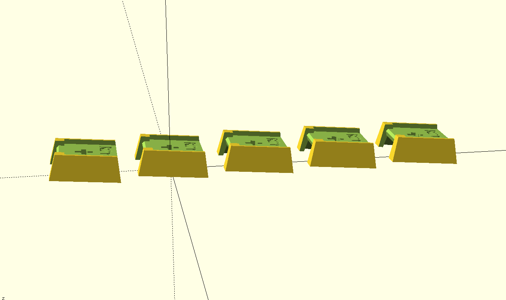
    These are the R2 stems from the [parts](parts) directory (14 pieces 1.25U and 58 pieces 1U). This works best if keyboard is inclined by 5 degrees or more.
  - Curved 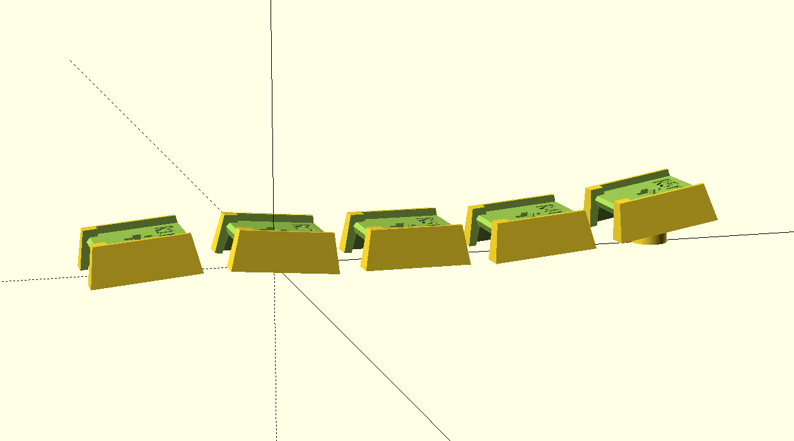
    Here you will need R1 to R5 from the [parts](parts) directory. (4x 1.25U R1, 10x 1U R1, 4x 1.25U R2, 12x 1U R2, 2x 1.25U R3, 12x 1U R3, 2x 1.25U R4, 12x 1U R4, 2x 1.25U R5, 12x 1U R5)
* Status display holder (or cover/dummy in case no status display is used), can be 3D printed.
  [parts/display_holder_r1.stl](parts/display_holder_r1.stl) / [parts/display_holder_dummy_r1.stl](parts/display_holder_dummy_r1.stl)
* Transparent keycap covers - 72 pieces (from relegendable keycaps [like these](https://de.aliexpress.com/item/1005002996832179.html?spm=a2g0o.order_list.order_list_main.111.49985c5f1EyPsm&gatewayAdapt=glo2deu)), 58x 1U and 14x 1.25U. Various sources sell them on Alibaba, AliExpress, Amazon & Co.
* Optional rotary encoder ([EVQWGD001](https://de.aliexpress.com/i/32990950196.html?gatewayAdapt=gloMsite2deuPcglo2deu) or [Alps EC11 Encoder](https://www.mouser.at/c/electromechanical/encoders/?m=Alps%20Alpine&series=EC11)), [pimoroni trackball](https://mou.sr/3rmFiAO) or [23mm cirque trackpad](https://www.mouser.at/ProductDetail/Cirque/TM023023-2024-002?qs=wd5RIQLrsJhgKZTW4CXgsA%3D%3D&countryCode=DE&currencyCode=EUR) (and a 12 pin FPC cable with pins on the same side, about 50mm to 70mm). For the trackpad you will need another 3D printed holder, either a high one or a low one: 
  [parts/cirque23_slim_insert_r8.stl](parts/cirque23_slim_insert_r8.stl)
  [parts/cirque23_insert_high_r1.stl](parts/cirque23_insert_high_r1.stl)
  If you are not happy with the existing STLs, you can also modify the source file [parts/cirque23_insert.stl](parts/cirque23_insert.stl) or [parts/cirque23_insert_slim.scad](parts/cirque23_insert_slim.scad). There is also an experimental version for the 35mm cirque track pad: [parts/cirque35_insert.scad](parts/cirque35_insert.scad).
* Short USB-C to USB-C cable to connect the two sides (maybe around 50cm).
* USB-C to USB-A/USB-C to connect to your computer.
  ***Note:*** I had a USB-C to USB-A cable and was sitting in front of a laptop with only USB-C ports. Without a USB-C to USB-C cable at hand, I used an USB-A to USB-C adapter. It turned out this USB-C to USB-A cable + USB-A to USB-C adapter construction was only working then the adapter was connected to the laptop. - better use a USB-C to USB-C right away.
* 8 M3x10 hex screws with rounded heads and for the new version of the case (r4), you also need 8 M3 hex nuts.

### Put Everything Together

Here is my recommended order:

1. In case you want to use an [Alps EC11 Encoder](https://www.mouser.at/c/electromechanical/encoders/?m=Alps%20Alpine&series=EC11) or some remaining stock of the not any more produced [EVQWGD001](https://de.aliexpress.com/i/32990950196.html?gatewayAdapt=gloMsite2deuPcglo2deu), put it on the PCB and also put the keyboard plate once on top to make sure your encoder fits! In case of the EVQWGD001, you have to remove the last pin, before soldering it to the PCB Juts clip it away. DO NOT solder it to the PCB, or otherwise it will not work:

Depending on the type of EC11 encoder, you maybe want to put a piece of Kapton tape over the legs, in case they come close to the plate (it was not necessary for mine, but there are different kinds out there).
1. For the [pimoroni trackball](https://mou.sr/3rmFiAO), please solder on the header without the little plastic distance holder. There are various ways to do that: Either solder them on and push the plastic with some pliers off the pins (and clip away the pins on the front side of the trackball so that it is flush) or insert them from the front side, solder them on and then clip away the plastic parts. The pins are still long enough. Just go for something that works for you.
   Next, put some Kapton tape on the back side of the trackball and solder it to the keyboard PCB. Make sure it is even on the front side, there will be an average 1 to 2mm distance:
   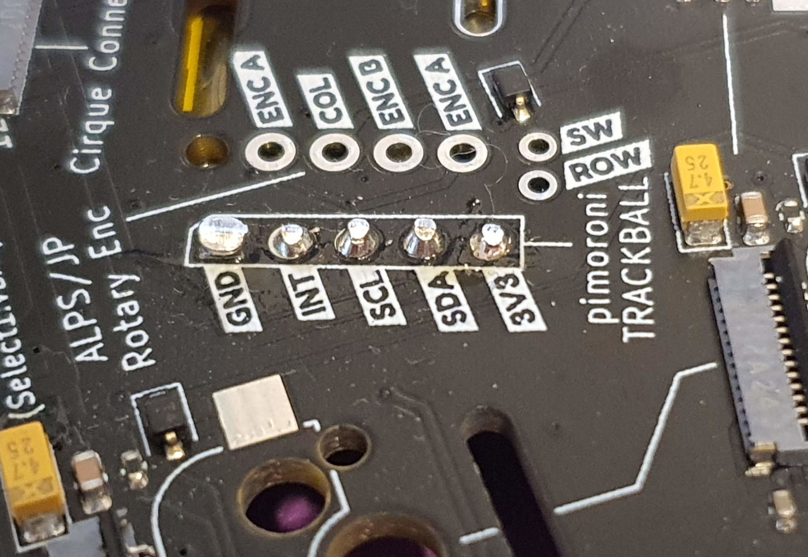
   
   Finally also cover the trackballs front side with Kapton tape like in the picture above (or anything that pleases your eye and insulates) to avoid any shorts since the top plate is made out of Aluminum.
2. In case you use the [23mm cirque trackpad](https://www.mouser.at/ProductDetail/Cirque/TM023023-2024-002?qs=wd5RIQLrsJhgKZTW4CXgsA%3D%3D&countryCode=DE&currencyCode=EUR), first remove R1 from the backside of the trackpad's PCB (with a solder iron or maybe a sharp knife) to activate I2C instead of SPI. Then connect the 12 pin FPC to the trackpad (and mind the pin 1 marking on the trackpad + I made my own marking on the FPC to make sure):
   
   Then, put it into the 3D printed holder. You can fix the trackpad with some adhesive tape or a few drops of super glue into the holder. Wait with connecting it to the PCB:
   
There is also an experimental version for the 35mm trackpad, take a look at the parts folder.
3. Insert the 0.96 inch status display into the display holder (bend the holder back and let it snap back to bracket the display). Connect the FPC with the socket on the PCB and lock it by lowering the brown flap on the FPC side (if you don't have a status display just close the cut out with the blind lid):
   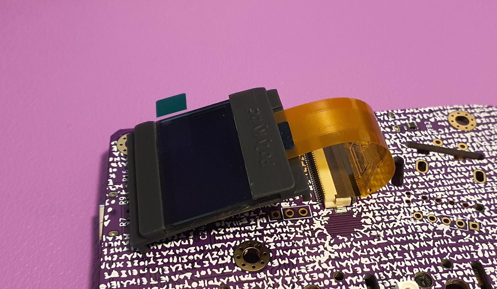
4. Put the spacer on top.
5. While putting the plate on top of the assembly, fit the status display holder (or blind) into the plate from the plates back side:
   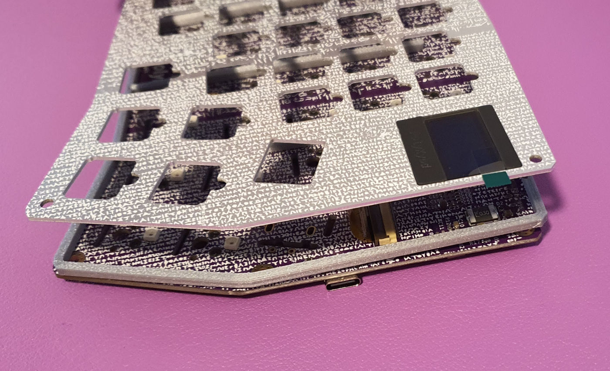
   Then, the plate rests on the spacer, which again rests on the PCB. I pushed in two screws temporarily to align plate and PCB:
   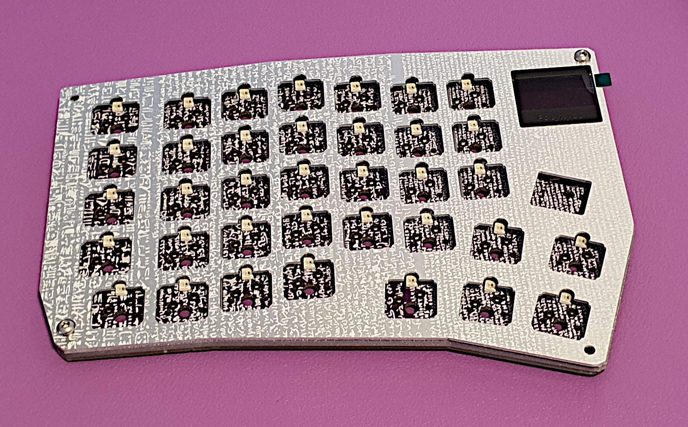
6. Now would be the time to fit in the optional cirque trackpad. First get the FPC cable through the slot:
   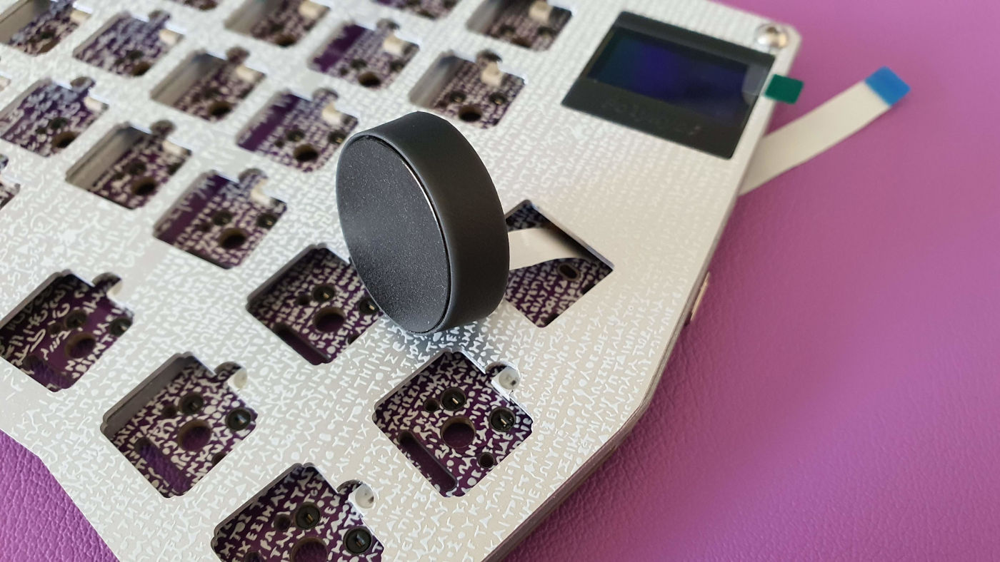 Next, push in the trackpad holder. It is a press-fit, so no glue needed, just push:
   
   Finally insert the FPC cable into the cirque socket and lock it by lowering the little flap on the back side of the socket (again make sure that pin 1 meets the side with the little 1 next to the socket):
   
   Depending on the keyboard side (left/right), the slot for the FPC to go through is located very close to the trackpad socket or a bit further away as on the picture.
7. Assemble all 72 keys: Put the stem on the key switch, put the flex cable through the LED slit of the key switch and and align the display. Finally put the clear keycap over it and make sure it sits flat on the stem. The display will slide into the stem when covering with the clear keycap. You don't need to pre-bend the flex cable. I rather recommend against bending it as you might damage it. The following images shows these 3 steps: 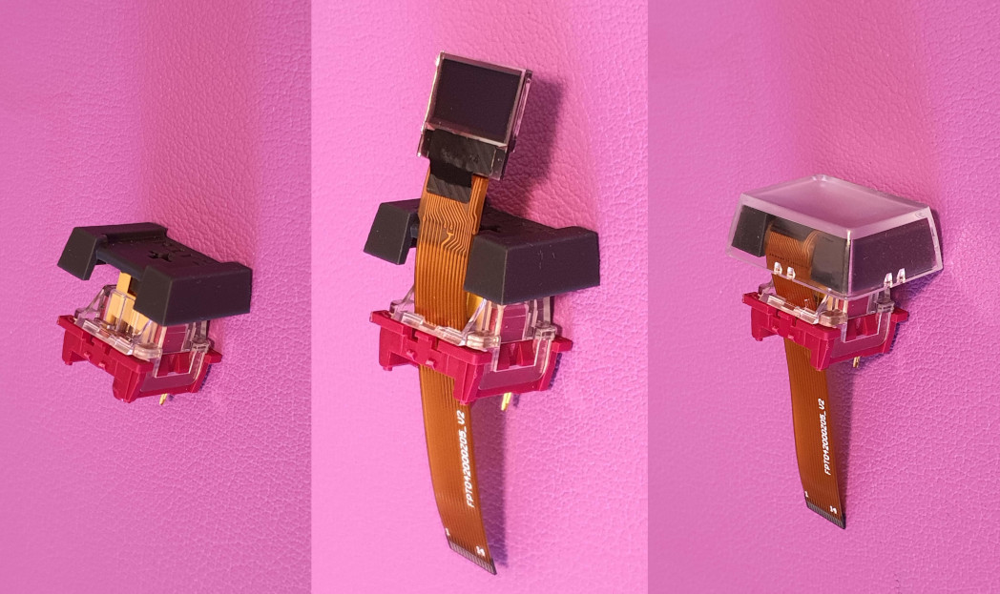
   Now repeat this for every key-switch. A fully prepared keyboard side of switches might look like this: 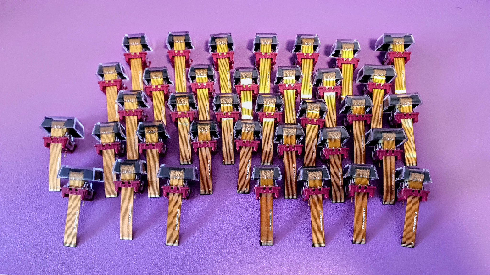
8.  Push in one assembled key switch at each corner so that everything aligns properly. To do that, first insert the flex cable into the PCB slot and push the key switch **straight** into the hot swap socket. You can check on the backside if both pins have been inserted properly:
   
   Here, only one pin is in the hot-swap socket. Pull the key switch out again, straighten the bent pin and reinsert carefully:
   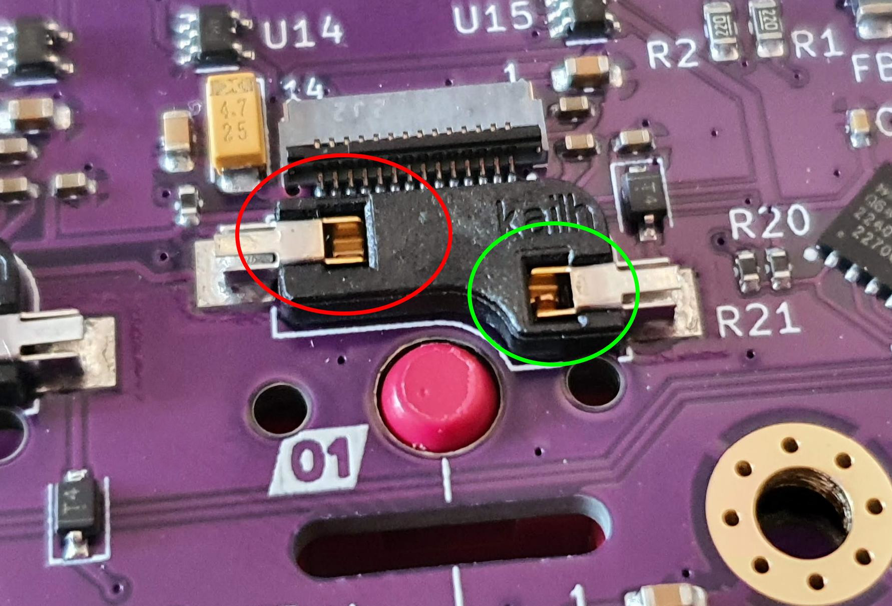
   This is how it looks like if there is no key switch inserted:
   
   Now your assembly should look like this:
   
9.  Insert the remaining key switches in the same way and check that the pins are visible as indicated above: 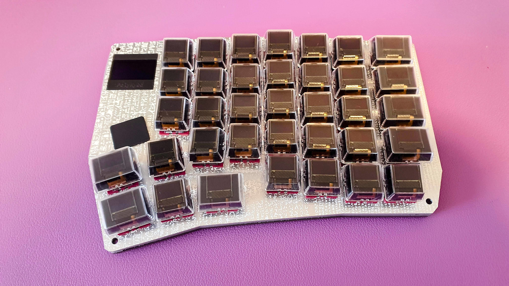
10. Start inserting the flex cables into the sockets: 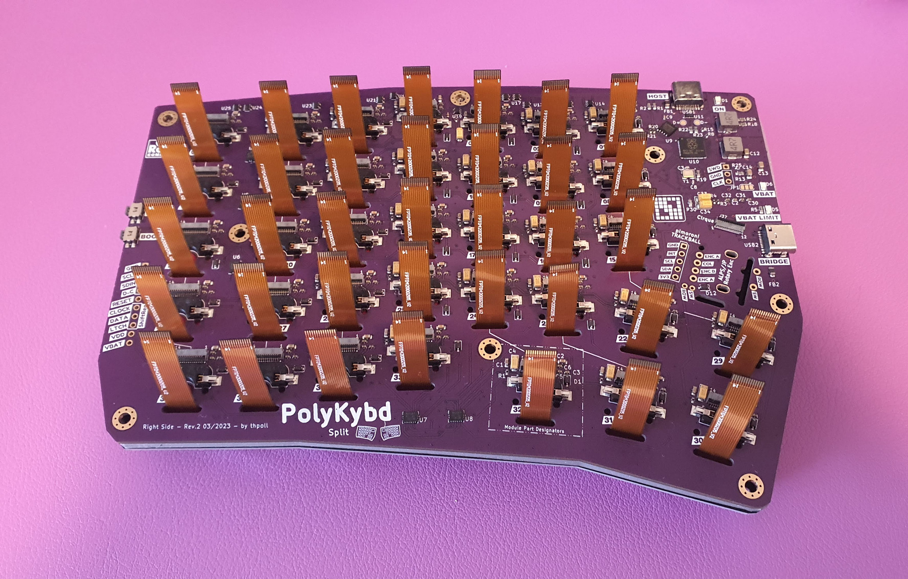 If the flex cable is not long enough for you, press the key switch to make it longer. But it should also work without doing that. You cas use some tweezers or also a toothpick to first lift the flap to unlock the socket. Insert the end part into the socket, again recommended with tweezers, but also works without (so with your hands - finger!). After inserting the flex cable, lock the socket. Lower the little flap on the back-side of the socket you lifted at the beginning:  The finished version should look like that: 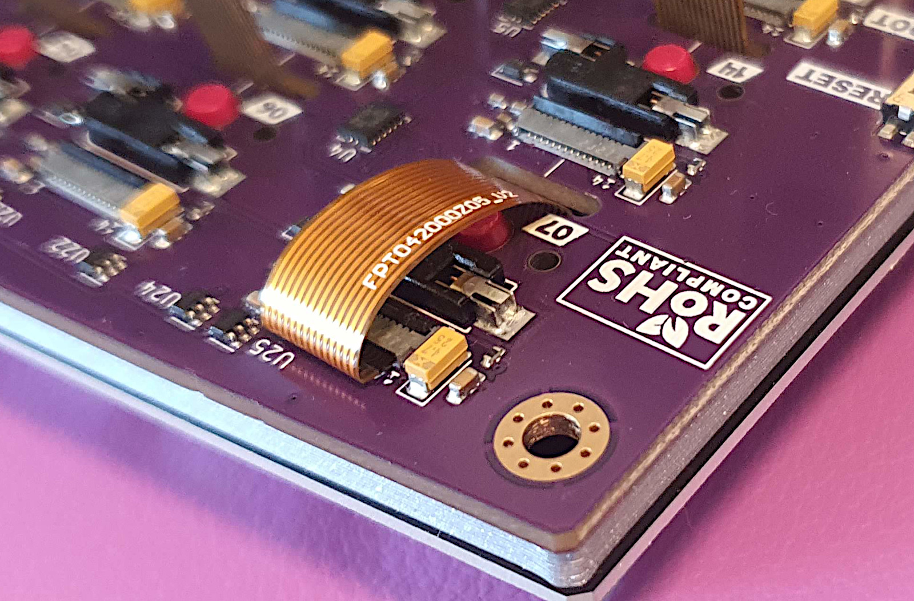 Now repeat this procedure for every flex cable.
11. In case you have a case with revision r4 or higher its now time to insert the hex nuts into the corners.
12. Before putting the whole assembly into the case, do a function check! If you have not yet flashed the firmware to the board, build one according to the instructions on https://github.com/thpoll83/qmk_firmware/blob/PolyKeyboard/keyboards/handwired/polykybd/readme.md and flash by first pressing the boot button and then connecting the USB-C while holding the button. After the you connect just release the button and copy the .hex file to the USB drive an you are set. There is no need to connect the second side (depending on the firmware version). When connected to power, after a second or two, all displays should show some characters. If not, disconnect the cable again, release the lock of the FPC display socket in question and re-insert the FPC cable, lock again and reconnect the USB-C port.
13. While still connected to USB-C press every key once. Each pressed key should invert its display contents. If not one or both pins might have been bent when inserting the key switch. If that is the case, pull the key switch out again, make the pins straight again and carefully insert one more time.
14. After we confirmed that all displays and all keys do work, put the assembly into the case: 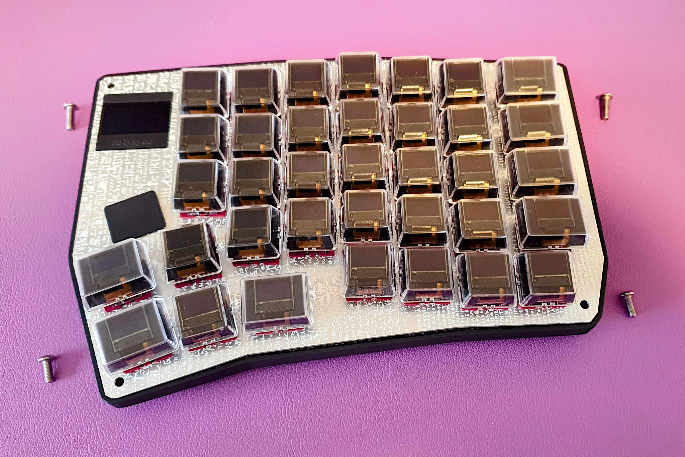 Start on the inner side, where the two halves are connected by the bridge USB-C socket. You maybe have to give it a gentle push on the other side to go in.
15. Insert the 4 hex screws and tighten them carefully. 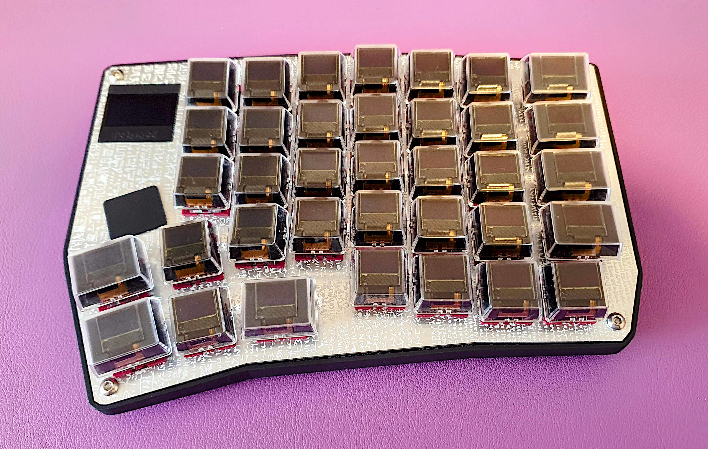 Now repeat with the other side ;)
16. Connect the two halves with the short USB-C to USB-C cable.
17. Finally connect the left side with the USB-C cable connecting to the host system and you are done!
18. Congratulations! You made it! 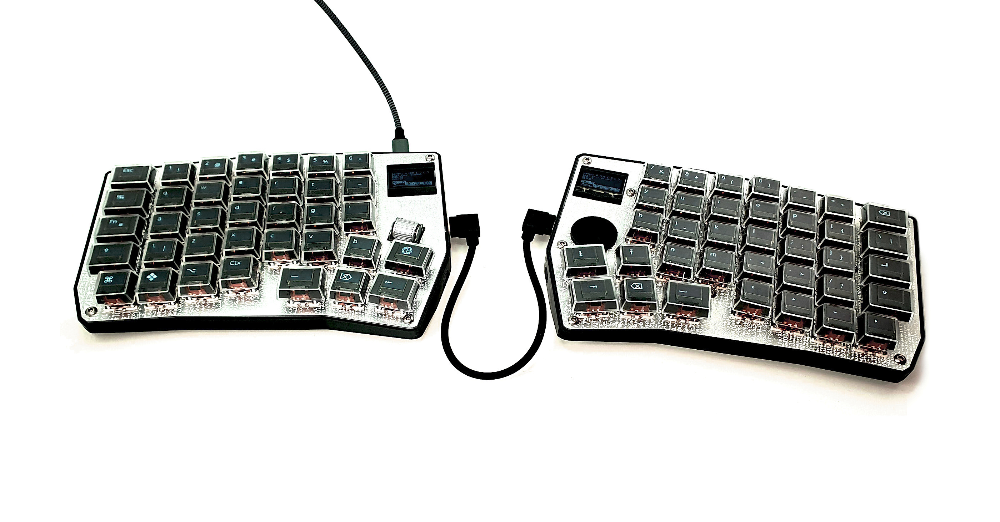 In case you experience any issues, pleas let me know or make a PR on the build guide!

The fun just starts now! You will recognize that there are a lot of ways to play around with this keyboard.

This project has been an incredible amount of work, please consider supporting me if you like it:
[https://ko-fi.com/polykb](https://ko-fi.com/polykb)

